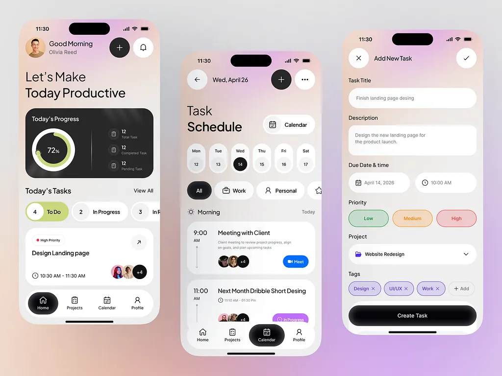

<div align="center">
  
  <h1>PrepPulse</h1>
  <p><strong>Study Together • Crack Placements • 90-Day Placement Ready Agenda</strong></p>

  [](https://reactnative.dev/)
  [](https://expo.dev/)
  [](https://www.typescriptlang.org/)
  [](https://insforge.dev)
  [](https://clerk.com/)
  [](LICENSE)

  <br />

  
</div>

<hr />

## 📌 Overview

**PrepPulse** is a comprehensive, production-ready React Native (Expo) mobile application engineered for engineering students and job seekers preparing for campus placements and technical interviews.

The app provides a structured **90-Day Daily Placement Agenda** covering five core tracks:
1. 🧩 **Striver A2Z Java & Data Structures & Algorithms (45 min/day)**
2. 💻 **Full-Stack Web Development: PERN & Spring Boot (35 min/day)**
3. 🧠 **IndiaBIX Quantitative Aptitude & Reasoning (35 min/day)**
4. 📚 **Computer Science Fundamentals & Technical Interview Notes**
5. 🚀 **Final Year Project (FYP) Workspace & Milestone Tracking**

---

## ✨ Key Features & Functionalities

### 1. 🗓️ Structured 90-Day Daily Agenda
* **Curated Curriculum**: 90 pre-seeded days of daily placement tasks with direct practice links (LeetCode, TakeUForward Striver A2Z, GeeksforGeeks, IndiaBIX).
* **Track Filters**: Seamlessly filter tasks by track (DSA, Web Dev, Aptitude, CS Notes, FYP).
* **Progress Ring & Streaks**: Real-time progress ring gauges tracking daily completion rate, total points, solved problems, and active streaks.

### 2. 🎬 2-Second Animated Splash & Session Persistence
* **Smooth Splash Animation**: Built-in 2-second logo scale/zoom and fade animation on app launch.
* **Persistent Sessions**: Integrated `@react-native-async-storage/async-storage` to preserve user onboarding status, user name, and progress across app restarts.

### 3. 🔐 Google OAuth & Clerk Authentication
* **One-Click Sign-In**: Integrated `@clerk/clerk-expo` with `WebBrowser.warmUpAsync()` for Google OAuth authentication on Android.
* **Personalized Onboarding**: Clean, centered onboarding interface with dynamic name input and touch-dismiss keyboard optimization.

### 4. 🚀 InsForge Cloud BaaS Backend Integration
* **Realtime Synchronization**: Cloud task completion and point progression synced directly to an **InsForge** Postgres database (`@insforge/sdk`).
* **Cloud Security**: Environment-controlled configuration with `.env` secret protection.

### 5. 🔔 OneSignal Push Notifications
* **Daily Reminders**: Automated notification reminders keeping candidates on track with their daily placement goals.

### 6. 🛠️ Final Year Project (FYP) Milestone Tracker & Custom Tasks
* **Custom Task Creator**: Create custom placement tasks assigned directly to specific days.
* **Milestone Kanban**: Add, track, and complete FYP deliverables (`planned`, `in_progress`, `completed`).

---

## 🛠️ Technology Stack

| Component | Technology |
| :--- | :--- |
| **Framework** | [React Native 0.81.5](https://reactnative.dev/) / [Expo SDK 54](https://docs.expo.dev/) |
| **Language** | [TypeScript 5.9](https://www.typescriptlang.org/) |
| **Routing** | [Expo Router v6](https://docs.expo.dev/router/introduction/) (File-based navigation) |
| **Styling** | Vanilla React Native StyleSheet + Warm Dark Theme System |
| **Backend (BaaS)** | [InsForge SDK](https://insforge.dev) (PostgreSQL Database) |
| **Authentication** | [Clerk Expo](https://clerk.com/) & WebBrowser OAuth |
| **Notifications** | [OneSignal Expo Plugin](https://onesignal.com/) |
| **Icons & Media** | [Lucide React Native](https://lucide.dev/) & React Native SVG |
| **Storage** | `@react-native-async-storage/async-storage` & `expo-secure-store` |

---

## 📂 Project Architecture

```
prep-pulse/
├── app/                      # Expo Router App Directory
│   ├── (auth)/               # Authentication Routes (Sign-in)
│   ├── (onboarding)/         # Personalized Onboarding Slides
│   ├── (tabs)/               # Main App Bottom Tab Navigation
│   │   ├── fyp.tsx           # FYP Milestones & Workspace
│   │   ├── index.tsx         # Today's 90-Day Placement Roadmap
│   │   ├── milestones.tsx    # Overall 90-Day Progress Dashboard
│   │   ├── profile.tsx       # User Profile & Streak Settings
│   │   └── roadmap.tsx       # 90-Day Interactive Master Calendar
│   ├── learn/                # Task Detail & Learning Screens
│   ├── _layout.tsx           # Root Layout & Provider Wrapper
│   ├── create-task.tsx       # Custom Task Creation Screen
│   ├── index.tsx             # 2-Second Animated Splash & Router
│   └── notifications.tsx     # Notifications Center Screen
├── assets/                   # Vector Icons, Logos & Optimized PNGs
├── components/               # Reusable UI Components
│   ├── DaySelector.tsx       # Day Carousel Bar
│   ├── ProgressRing.tsx      # SVG Progress Circle Gauge
│   └── TaskCard.tsx          # Interactive Task Card Item
├── constants/                # 90-Day Seeded Placement Curriculum
├── context/                  # AppContext State & Persistent Storage
├── lib/                      # InsForge SDK & OneSignal Integration
├── eas.json                  # EAS Build Configuration
├── metro.config.js           # Metro Bundler Polyfills Setup
├── package.json              # Project Dependencies
└── README.md                 # Project Documentation
```

---

## 🚀 Getting Started

### Prerequisites
* **Node.js** (v18 or higher)
* **npm** or **yarn**
* **Expo Go** app (or Android Studio for emulator testing)

### Installation

1. **Clone the repository**:
   ```bash
   git clone https://github.com/Aswinsaipalakonda/PrepPulse.git
   cd PrepPulse
   ```

2. **Install dependencies**:
   ```bash
   npm install --legacy-peer-deps
   ```

3. **Configure Environment Variables**:
   Create a `.env` file in the root directory:
   ```env
   EXPO_PUBLIC_INSFORGE_URL=https://94x5hqp9.ap-southeast.insforge.app
   EXPO_PUBLIC_INSFORGE_ANON_KEY=your_insforge_anon_key
   EXPO_PUBLIC_CLERK_PUBLISHABLE_KEY=your_clerk_publishable_key
   ```

4. **Start the Development Server**:
   ```bash
   npx expo start
   ```

---

## 📱 Building the Android APK Locally

You can generate the standalone release `.apk` directly on Windows/Linux using Gradle:

1. **Prebuild Native Android Project**:
   ```bash
   npx expo prebuild --platform android
   ```

2. **Compile Release APK via Gradle**:
   ```powershell
   $env:JAVA_HOME="C:\Program Files\Android\Android Studio\jbr"
   cmd /c "cd android && gradlew assembleRelease --no-daemon"
   ```

3. **Output Location**:
   ```
   android/app/build/outputs/apk/release/app-release.apk
   ```

---

## 📥 Latest Release Download

You can download the ready-to-install Android APK directly from GitHub Releases:

👉 [**Download PrepPulse v1.0.0 APK**](https://github.com/Aswinsaipalakonda/PrepPulse/releases)

---

## 📄 License

This project is licensed under the [MIT License](LICENSE).

---

<div align="center">
  <p>Built with ❤️ by <a href="https://github.com/Aswinsaipalakonda">Aswin Sai</a> for placement aspirants everywhere.</p>
</div>
